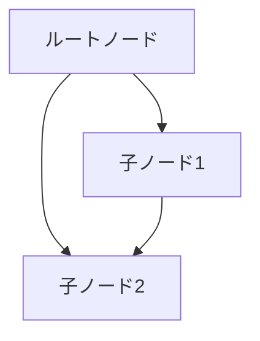

# プロセス1: ファイル読み込み

## 目的

コマンドラインで指定されたMermaidファイル(.mmd)を読み込み、テキストデータとして取得する。

## 実装場所

- エントリーポイント: `cli/main.js`
- ユーティリティ: `cli/utils/file.js` の `readMermaidFile()`

## 処理の流れ

### 1. コマンドライン引数の解析

```
$ node cli/main.js [入力ファイル] [出力ファイル]
```

**引数:**
- 第1引数: 入力mmdファイルのパス（省略時: `sample.mmd`）
- 第2引数: 出力HTMLファイルのパス（省略時: `output.html`）

**実装:**
```javascript
const args = process.argv.slice(2);
const inputFile = args[0] || 'sample.mmd';
const outputFile = args[1] || 'output.html';
```

### 2. ファイル存在確認

入力ファイルが存在しない場合、エラーを発生させる。

**エラーメッセージ例:**
```
Error: Failed to read file sample.mmd: ENOENT: no such file or directory
```

### 3. ファイル内容の読み込み

Node.jsの`fs.readFileSync()`を使用し、UTF-8エンコーディングでテキストとして読み込む。

**実装:**
```javascript
const fs = require('fs');
const mermaidContent = fs.readFileSync(inputFile, 'utf-8');
```

### 4. コンソール出力

読み込み開始を通知する。

```
Reading: tests/fixtures/test-dag-complex.mmd
```

## 入力例

**ファイル: sample.mmd**


## 出力データ

ファイル全体が文字列として読み込まれる:

```javascript
"graph TD\n    A[ルートノード]\n    B[子ノード1]\n    C[子ノード2]\n    \n    A --> B\n    A --> C\n    B --> C\n"
```

## エラーケース

### ケース1: ファイルが存在しない

**エラー:**
```
Error: Failed to read file notfound.mmd: ENOENT: no such file or directory
```

**処理:**
- エラーメッセージを表示
- 使用方法を表示
- プロセス終了（exit code 1）

### ケース2: 読み込み権限がない

**エラー:**
```
Error: Failed to read file sample.mmd: EACCES: permission denied
```

**処理:**
- エラーメッセージを表示
- プロセス終了

### ケース3: 引数が不足

**動作:**
- デフォルト値を使用（`sample.mmd`, `output.html`）
- エラーにはならない

## 次のプロセス

読み込まれたテキストデータは、パース処理（02-parsing.md）に渡される。

## 関連ファイル

- `cli/main.js` - メイン処理
- `cli/utils/file.js` - ファイルI/Oユーティリティ
