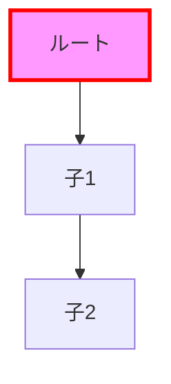

# プロセス2: パース処理

## 目的

生のMermaidテキストを解析し、ノード、エッジ、スタイル、クラス定義の構造化データに変換する。

## 実装場所

- `src/core/parsers/mermaid.js`

## 処理の流れ

### 全体概要

パース処理は4つの独立した関数で構成される:

1. `parseMermaidNodes()` - ノード定義の抽出
2. `parseMermaidConnections()` - エッジ（接続）の抽出
3. `parseMermaidStyles()` - インラインスタイルの抽出
4. `parseMermaidClassDefs()` - クラス定義とクラス割り当ての抽出

各関数は同じテキストを受け取り、異なる側面を解析する。

---

## 1. ノードパース (`parseMermaidNodes`)

### 目的
グラフ内のノード定義を抽出し、ID、ラベル、形状、クラスを識別する。

### 認識するパターン

#### 基本形状
```mermaid
A[ラベル]          # 四角形
B(ラベル)          # 角丸
C{ラベル}          # 菱形
D([ラベル])        # スタジアム型
E[[ラベル]]        # サブルーチン
F[(ラベル)]        # シリンダー
G((ラベル))        # 円形
H{{ラベル}}        # 六角形
I[/ラベル/]        # 台形
J[\ラベル\]        # 逆台形
```

#### 引用符付きラベル
```mermaid
A["複雑な ラベル"]
B("HTMLタグ <br> 対応")
```

#### クラス割り当て（ショートハンド）
```mermaid
A[ノード]:::className
```

#### 形状指定
```mermaid
A@{ shape: cyl }
```

### 出力データ構造

```javascript
[
    {
        id: "A",
        label: "ルートノード",
        classes: ["highlighted"],
        shape: "square"  // オプション
    },
    {
        id: "B",
        label: "子ノード",
        classes: []
    }
]
```

### パース手順

1. **行ごとに処理**
   - 空行とコメント（`%%`）をスキップ
   - `graph`/`flowchart`宣言をスキップ

2. **形状指定構文のチェック**
   - `A@{ shape: cyl }` パターンをマッチ
   - ノードマップに形状情報を追加

3. **ショートハンドクラス構文のチェック**
   - `D:::className` パターンをマッチ
   - クラス情報を追加

4. **ノード定義パターンマッチング**
   - 複雑なパターンから順にマッチング（長いパターン優先）
   - 引用符付き→引用符なし の順

5. **重複チェック**
   - 同じIDのノードは1つだけ保持
   - 後の定義で情報を追加（クラス、形状）

---

## 2. エッジパース (`parseMermaidConnections`)

### 目的
ノード間の接続関係とエッジラベルを抽出する。

### 認識するパターン

#### 基本的な接続
```mermaid
A --> B          # AからBへの矢印
A --- B          # 無向辺（矢印なし）
```

#### ラベル付き接続
```mermaid
A -->|ラベル| B
A -.->|点線| B
```

#### 引用符付きラベル
```mermaid
A -->|"複雑な ラベル"| B
```

#### 点線
```mermaid
A -.-> B         # 点線矢印
```

#### チェーン記法
```mermaid
A --> B --> C
```

### 出力データ構造

```javascript
[
    {
        from: "A",
        to: "B",
        label: "エッジラベル"
    },
    {
        from: "B",
        to: "C",
        label: ""
    }
]
```

### パース手順

1. **行ごとに処理**
   - 矢印パターン（`-->`, `---`, `-.->` など）を検出

2. **ラベル抽出**
   - `|ラベル|` または `|"ラベル"| パターンをマッチ
   - ラベルがない場合は空文字列

3. **チェーン処理**
   - `A --> B --> C` を `A-->B`, `B-->C` に分解
   - 各ペアで独立したエッジを生成

4. **重複除去**
   - 同じ from-to ペアは1つだけ保持

---

## 3. スタイルパース (`parseMermaidStyles`)

### 目的
ノードに適用するインラインスタイルを抽出する。

### 認識するパターン

```mermaid
style A fill:#f9f,stroke:#333,stroke-width:4px
style B fill:#bbf,color:#fff
```

### 出力データ構造

```javascript
{
    "A": {
        "fill": "#f9f",
        "stroke": "#333",
        "stroke-width": "4px"
    },
    "B": {
        "fill": "#bbf",
        "color": "#fff"
    }
}
```

### パース手順

1. **style行の検出**
   - `style ノードID ...` パターンをマッチ

2. **スタイルプロパティのパース**
   - カンマ区切りのCSS風プロパティを分解
   - `property:value` ペアを抽出

3. **CSSプロパティ名の正規化**
   - ハイフン付きプロパティ名を保持（`stroke-width`）

---

## 4. クラス定義パース (`parseMermaidClassDefs`)

### 目的
クラス定義とノードへのクラス割り当てを抽出する。

### 認識するパターン

#### クラス定義
```mermaid
classDef className fill:#f96,stroke:#333
```

#### クラス割り当て
```mermaid
class A,B,C className
```

### 出力データ構造

```javascript
{
    classDefs: {
        "highlighted": {
            "fill": "#f96",
            "stroke": "#333"
        }
    },
    classAssignments: {
        "A": ["highlighted", "important"],
        "B": ["highlighted"]
    }
}
```

### パース手順

1. **classDef行の検出**
   - `classDef クラス名 スタイル` パターンをマッチ
   - スタイルプロパティを解析

2. **class割り当て行の検出**
   - `class ノードID1,ノードID2,... クラス名` パターンをマッチ
   - カンマ区切りのノードIDを分解

3. **クラスのマージ**
   - 同じノードに複数のクラスが割り当て可能
   - 配列に追加

---

## クラス割り当てのマージ

パース後、main.jsでクラス割り当てをノードオブジェクトにマージする:

```javascript
nodes.forEach(node => {
    if (classAssignments[node.id]) {
        if (!node.classes) {
            node.classes = [];
        }
        classAssignments[node.id].forEach(className => {
            if (!node.classes.includes(className)) {
                node.classes.push(className);
            }
        });
    }
});
```

---

## パース結果の例

**入力:**


**出力:**
```javascript
// nodes
[
    { id: "A", label: "ルート", classes: ["important"] },
    { id: "B", label: "子1", classes: [] },
    { id: "C", label: "子2", classes: [] }
]

// connections
[
    { from: "A", to: "B", label: "" },
    { from: "B", to: "C", label: "" }
]

// styles
{
    "A": { "fill": "#f9f" }
}

// classDefs
{
    "important": { "stroke": "#f00", "stroke-width": "3px" }
}
```

---

## コンソール出力

```
Parsed 3 nodes and 2 connections
```

---

## 次のプロセス

パースされたデータは、バリデーション処理（03-validation.md）に渡される。

## 関連ファイル

- `src/core/parsers/mermaid.js` - パーサー実装
- `cli/main.js` - パース関数の呼び出し
